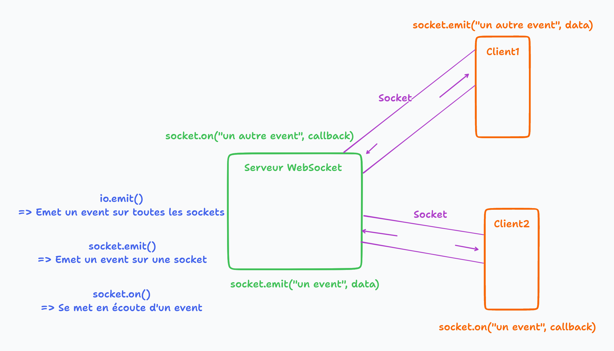

# Projet O'Draw

- ViteJs
- VueJS
- TypeScript
- Websocket

## Typescript

- C'est du Js avec des types
  - Compilé vers du JS : les fichiers TS sont traduits en JS

```ts
function multiply(a: number, b: number) {
  return a * b;
}

multiply(10, "5"); // Ne nous liasse pas compiler.
multiply(10, 5); // OK
```

```ts
interface Person {
  firstname: string;
  lastname: string;
  age: number;
}

function greetings(person: Person) {
  console.log(`Bonjour, je m'appelle ${person.firstname} ${person.lastname} et j'ai ${person.age} !`);
}

const bob = {
  firstname: "Bob",
  job: "Sales man",
  age: 29
}
greetings(bob); // Ne compile pas car l'objet bob ne respecte pas l'interface définit plus haut

const alice = {
  firstname = "Alice"
  lastname = "Durand"
  age = 30
}
greetings(alice); // OK

```

## Workflow

- Ici notre backend va servir notre front
  - On va intégrer notre "sous projet front VueJS" dans le code du backend, on compile et on sert statiquement
  - => On sert statiquement le résultat du build de notre code front `client/dist/`

- Pour l'instant lorsqu'on fait un `npm run dev` depuis le dossier `client/`, on a un serveur de dev qui nous sert le front.
  - On va venir modifier ça pour que le front soit servit par notre app express

## WebSocket

L'API WebSocket est une technologie évoluée qui permet d'ouvrir un canal de communication bidirectionnelle entre un navigateur (côté client) et un serveur. Avec cette API vous pouvez envoyer des messages à un serveur et recevoir ses réponses de manière événementielle sans avoir à aller consulter le serveur pour obtenir une réponse.


